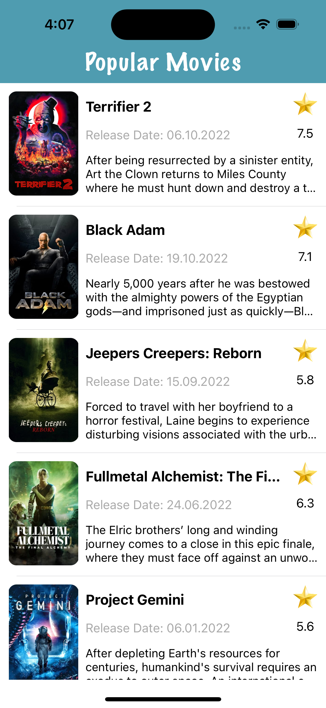

# Movie-App-Rest-API

Fetching data from the server in swift - Rest API

Movie app that user can scroll to find the most recent popular movies.
I used TMDb API to get the data, please check them at https://www.themoviedb.org/documentation/api

